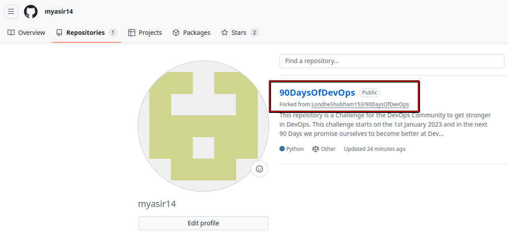
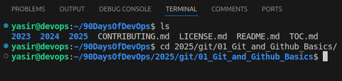
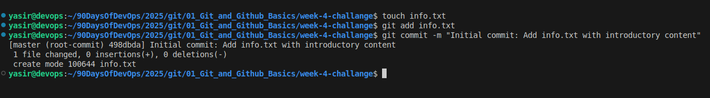

# Challenge Tasks

## Task 1: Fork and Clone the Repository

### Fork the Repository:
- Visit this repository and fork it to your own GitHub account if not done yet.

### Clone Your Fork Locally:
- Clone the forked repository using HTTPS:
  ```sh
  git clone <your-fork-url>
  ```
- Change directory into the cloned repository:
  ```sh
  cd 2025/git/01_Git_and_Github_Basics
  ```

## Answer





## Task 2: Initialize a Local Repository and Create a File

### Set Up Your Challenge Directory:
- Inside the cloned repository, create a new directory for this challenge:
  ```sh
  mkdir week-4-challenge
  cd week-4-challenge
  ```

### Initialize a Git Repository:
- Initialize the directory as a new Git repository:
  ```sh
  git init
  ```

## Answer


### Create a File:
- Create a file named `info.txt` and add some initial content (for example, your name and a brief introduction).

### Stage and Commit Your File:
- Stage the file:
  ```sh
  git add info.txt
  ```
- Commit the file with a descriptive message:
  ```sh
  git commit -m "Initial commit: Add info.txt with introductory content"
  ```

## Answer

  

## Task 3: Configure Remote URL with PAT and Push/Pull

### Configure Remote URL with Your PAT:
- Replace `<your-username>`, `<your-PAT>`, and `<repository-name>` with your actual GitHub username, your PAT, and the repository name respectively:
  ```sh
  git remote add origin https://<your-username>:<your-PAT>@github.com/<your-username>/90DaysOfDevOps.git
  ```
- If a remote named `origin` already exists, update it with:
  ```sh
  git remote set-url origin https://<your-username>:<your-PAT>@github.com/<your-username>/90DaysOfDevOps.git
  ```

## Answer


### Push Your Commit to Remote:
- Push your current branch (typically `main`) and set the upstream:
  ```sh
  git push -u origin main
  ```

### (Optional) Pull Remote Changes:
- Verify your configuration by pulling changes:
  ```sh
  git pull origin main
  ```

## Task 4: Explore Your Commit History

### View the Git Log:
- Check your commit history using:
  ```sh
  git log
  ```
- Take note of the commit hash and details as you will reference these in your documentation.

## Task 5: Advanced Branching and Switching

### Create a New Branch:
- Create a branch called `feature-update`:
  ```sh
  git branch feature-update
  ```

### Switch to the New Branch:
- Switch using `git switch`:
  ```sh
  git switch feature-update
  ```
- Alternatively, you can use:
  ```sh
  git checkout feature-update
  ```

### Modify the File and Commit Changes:
- Edit `info.txt` (for example, add more details or improvements).
- Stage and commit your changes:
  ```sh
  git add info.txt
  git commit -m "Feature update: Enhance info.txt with additional details"
  git push origin feature-update
  ```

### Merge this Branch to `main` via a Pull Request on GitHub.

### (Advanced) Optional Extra Challenge:
- Create another branch (e.g., `experimental`) from your `main` branch, make a conflicting change to `info.txt`, then switch back to `feature-update` and merge `experimental` to simulate a merge conflict.
- Resolve the conflict manually, then commit the resolution.

## Task 6: Explain Branching Strategies

### Document Your Process:
- Create (or update) a file named `solution.md` in your repository.
- List all the Git commands you used in Tasks 1–4.
- Explain why branching strategies are important in collaborative development. Consider addressing:
  - Isolating features and bug fixes
  - Facilitating parallel development
  - Reducing merge conflicts
  - Enabling effective code reviews

## Bonus Task: Explore SSH Authentication

### Generate an SSH Key (if not already set up):
- Create an SSH key pair:
  ```sh
  ssh-keygen
  ```
- Follow the prompts and locate your public key (typically found at `~/.ssh/id_ed25519.pub`).

### Add Your SSH Public Key to GitHub:
- Copy the contents of your public key and add it to your GitHub account under **SSH and GPG keys**.
- (See **Connecting to GitHub with SSH** for help.)

### Switch Your Remote URL to SSH:
- Change the remote URL from HTTPS to SSH:
  ```sh
  git remote set-url origin git@github.com:<your-username>/90DaysOfDevOps.git
  ```

### Push Your Branch Using SSH:
- Test the SSH connection by pushing your branch:
  ```sh
  git push origin feature-update
  ```

## 📢 How to Submit

### Push Your Final Work:
- Ensure your branch (e.g., `feature-update`) with the updated `solution.md` file is pushed to your fork.

### Create a Pull Request (PR):
- Open a PR from your branch to the main repository.
- Use a clear title such as:
  ```
  Week 4 Challenge - DevOps Batch 9: Git & GitHub Advanced Challenge
  ```
- In the PR description, summarize your process and list the Git commands you used.

### Share Your Experience on LinkedIn:
- Write a LinkedIn post summarizing your Week 4 experience.
- Include screenshots or logs of your tasks.
- Use hashtags: `#90DaysOfDevOps #GitGithub #DevOps`
- Optionally, share any blog posts, GitHub repos, or articles you create about this challenge.


